-   [Button erstellen](button.md)
-   [Value erstellen](value.md)
-   [Switch with Slider erstellen](switch_w_slider.md)
-   [Division Line erstellen](division.md)
-   [Web View erstellen](webview.md)
-   [Table erstellen](table.md)
-   [Graph (only sql Adapter) erstellen](graph.md)

## Advanced/Flexible

- Nach links wischen um ein Widget zu löschen.
- Rechts unten das Pluszeichen drücken.

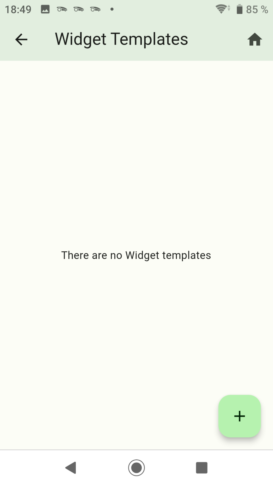

- `Name`: Name vom Widget
- `Value` (optional): Anzeigetext im Widget. Wird nichts angegeben wird der Name verwendet.

- Main Body: Hier das gewünschte Widget auswählen.

- `Value` Damit kann ein Value angezeigt werden und zusätzlich bei einem vorgegebenen Wert einen neuen Wert setzen
- `Multi Selection` Hier kann man ein Dropdown erstellen.
- `Slider` Mit dem Slider kann man Lampen dimmen oder Rollladen steuern.
- `Handle` Ein Switch bei dem der Wert vorgeben werden kann.
- `Button` Derzeit nur ein Button um TRUE zu setzen.

### Widget `Value`

- `Round to`: Nach dem Komma aufrunden
- `Unit (optional)`: Einheit vom Value
- `Device`: Hier den gewünschten Enum auswählen
- `Datapoint`: Auswahl der Datenpunkte aus dem gewählten Enum
- `Text Rules`: Um eine Regel zu erstellen auf `add` klicken. In `Old Value` den Wert eintragen wann der Datenpunkt dann mit `New Value` überschrieben werden soll. Dann `add` drücken und wenn keine neuen benötigt werden `exit` drücken. Wenn Value die 10 erreicht wird der Datenpunkt auf 20 gesetzt. Eine Editierung ist später nicht möglich. Die Regel kann nur mit wischen gelöscht werden.

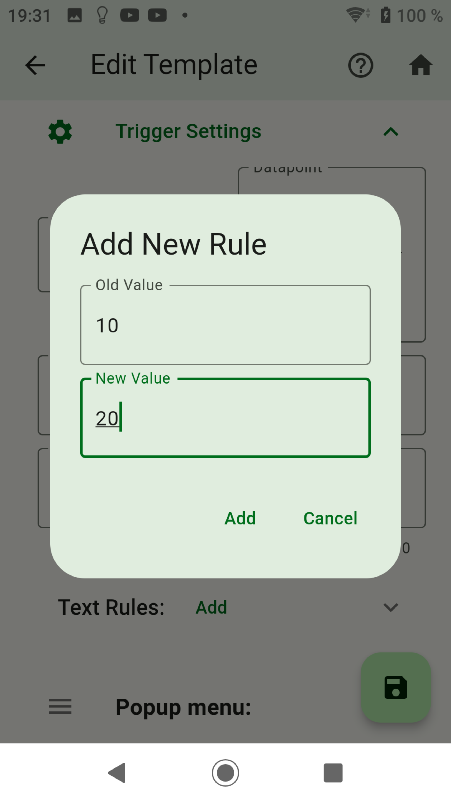

- `Popup Menu`: Hier können weitere Widgets erstellt werden. Durch langes drücken auf das Widget öffnet sich ein Popup Menu mit den erstellten Widgets.
- Danach speichern drücken.

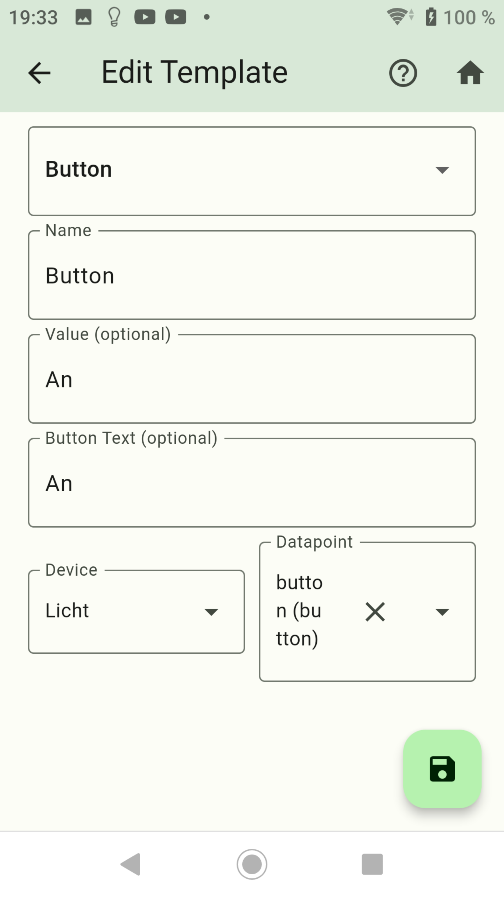
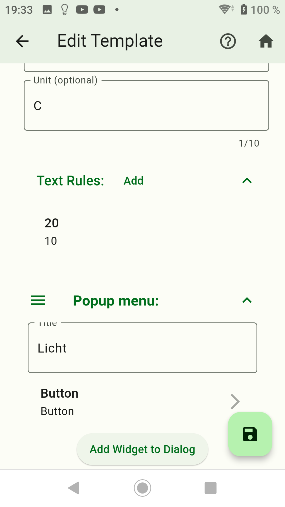

### Widget `Multi Selection`

- `Device`: Hier den gewünschten Enum auswählen
- `Datapoint`: Auswahl der Datenpunkte aus dem gewählten Enum

- `Selections`: Um eine Auflistung zu erstellen auf `add` klicken. In `Display Value` einen Namen der Auswahl angeben und in `Dateipoint Value` den Wert eintragen der in den Datenpunkt geschieben werden soll. Die Selections können später durch langes Drücken noch sortiert werden. Eine Editierung ist später nicht möglich. Die Regel kann nur mit wischen gelöscht werden.
- `Popup Menu`: Hier können weitere Widgets erstellt werden. Durch langes drücken auf das Widget öffnet sich ein Popup Menu mit den erstellten Widgets.
- Danach speichern drücken.

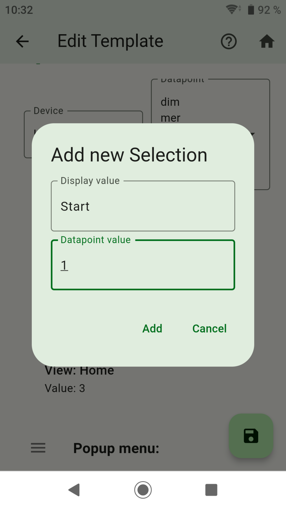
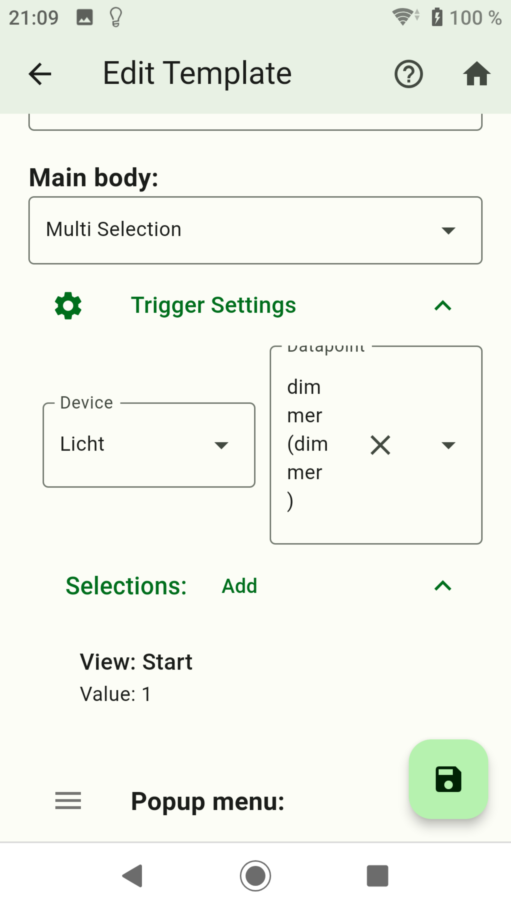

- So sieht es dann in der View aus. Hier erkennt man auch das vergessen wurde die 0 anzulegen.

### Widget `Slider`

- `Device`: Hier den gewünschten Enum auswählen
- `Datapoint`: Auswahl der Datenpunkte aus dem gewählten Enum - Datenpunkt muss number 0-x sein!

- `Min`: Wert minimal (Standard 0).
- `Max`: Wert maximal (Standard 100).
- `Steps`: In welchen Schritten Änderungen durchgeführt werden dürfen (Standard 10).
- `Popup Menu`: Hier können weitere Widgets erstellt werden. Durch langes drücken auf das Widget öffnet sich ein Popup Menu mit den erstellten Widgets.
- Danach speichern drücken.

- So sieht es dann in der View aus.

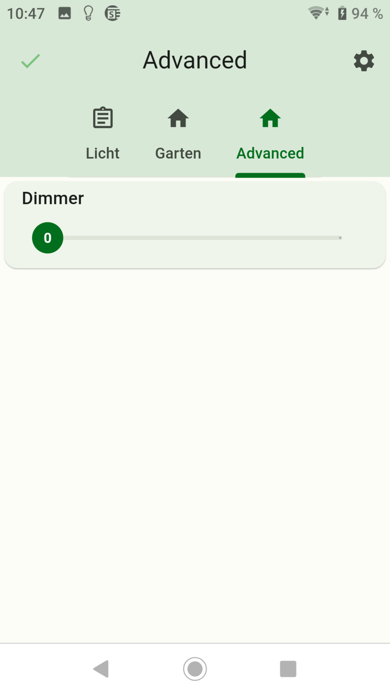

### Widget `Handle`

- `Device`: Hier den gewünschten Enum auswählen
- `Datapoint`: Auswahl der Datenpunkte aus dem gewählten Enum - Datenpunkt muss number 0-x sein!

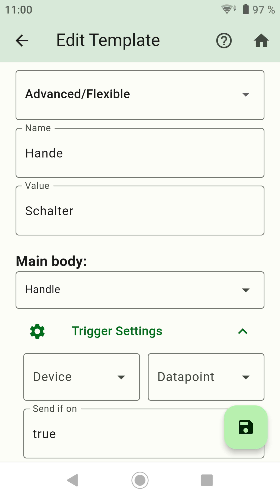

- `Send if on`: Wert der bei AN in den Datenpunkte gesetzt werden soll.
- `Send if off`: Wert der bei AUS in den Datenpunkte gesetzt werden soll.
- `Popup Menu`: Hier können weitere Widgets erstellt werden. Durch langes drücken auf das Widget öffnet sich ein Popup Menu mit den erstellten Widgets.
- Danach speichern drücken.

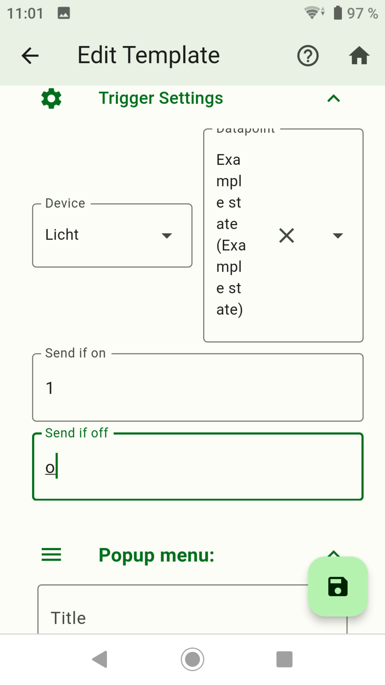

- So sieht es dann in der View aus.

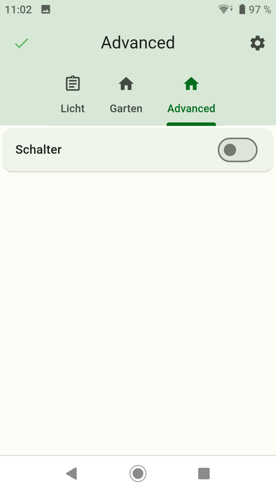

### Widget `Button`

- `Device`: Hier den gewünschten Enum auswählen
- `Datapoint`: Auswahl der Datenpunkte aus dem gewählten Enum - Datenpunkt muss number 0-x sein!

- `Button Lable`: Text im Button.
- `Popup Menu`: Hier können weitere Widgets erstellt werden. Durch langes drücken auf das Widget öffnet sich ein Popup Menu mit den erstellten Widgets.
- Danach speichern drücken.

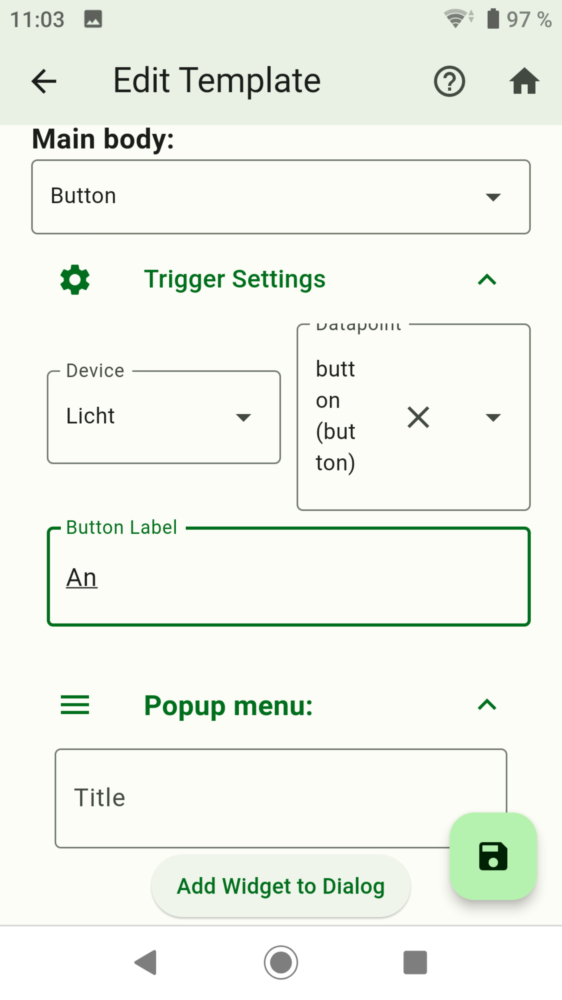

- So sieht es dann in der View aus.

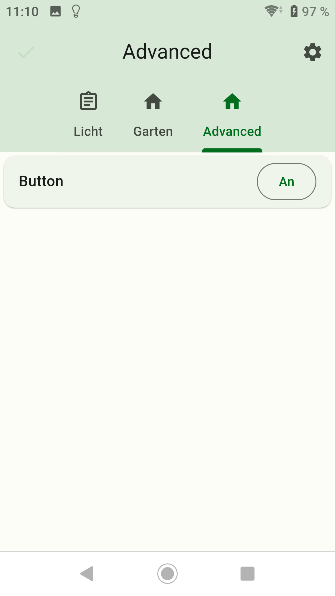

-   [Button erstellen](button.md)
-   [Value erstellen](value.md)
-   [Switch with Slider erstellen](switch_w_slider.md)
-   [Division Line erstellen](division.md)
-   [Web View erstellen](webview.md)
-   [Table erstellen](table.md)
-   [Graph (only sql Adapter) erstellen](graph.md)