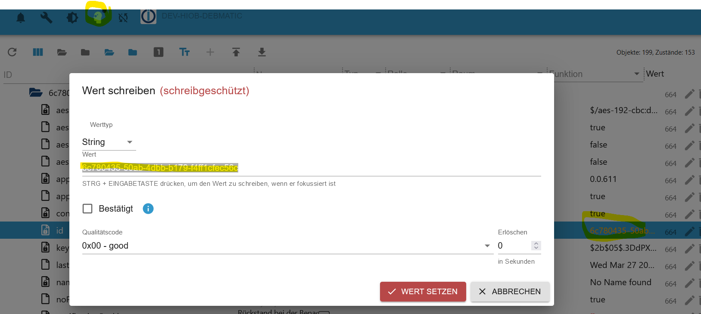
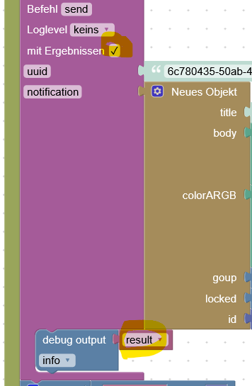
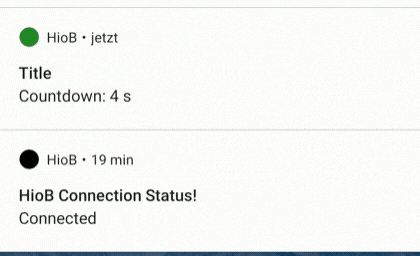

-   [Zurück zur Beschreibung](/docs/de/README.md)

## Notifications

❗**Wichtig** ❗: Dieses Feature ist noch in der beta Phase. Das bedeutet:

- Wenn die App **keine** aktive Verbindung zum ioBroker hat, so werden bis zu **maximal** 250 Nachrichten gespeichert. Und bei neu Verbindung gesendet
- Es gibt **keine** Garantie, dass Benachrichtigungen empfangen werden
- Es kann zu einem **erheblichen** Akku verbrauch kommen
- Die App kann **jederzeit** die Verbindung zum Server **verlieren**, wenn diese im Hintergrund ist

### Erste Schritte

1. Schalte die Batterieoptimierung auf ihrem Gerät für die App aus. (Unter den Geräteeinstellungen)
   - Dies soll verhindern, dass Android die App im Hintergrund aus Energiespargründen stoppt.
2. Erlaube Benachrichtigungen für die App
3. Aktiviere Background Notifications in der App unter den Einstellungen
4. Starte die App einmal neu

### Benachrichtigungen senden

- Hierfür gehst du in die ioBroker objects und suchst unter hiob.x.devices dein Gerät aus
- Hier sollte nun auch ein "sendNotification" Datenpunkt sein
- Setze den Datenpunkt auf einen beliebigen Text -> Nachricht wird gesendet

### Benutzerdefinierte Benachrichtigungen
#### Schema

```JSON
{
	"$schema": "https://json-schema.org/draft/2019-09/schema",
    "type": "object",
    "properties": {
      "title": {
      	"type": "string",
        "descreption": "The title of your notification",
        "exclusiveMinimum": 0
      },
      "body": {
      	"type": "string",
        "descreption": "The body of your notification",
        "exclusiveMinimum": 0
      },
      "locked": {
      	"type": "boolean",
        "descreption": "Wether it should be dissmisable ",
      },
      "group": {
      	"type": "boolean",
        "descreption": "Goups ",
      },
      "colorARGB": {
      	"type": "string",
        "descreption": "ARGB Color Hex code ",
      },
      "id": {
      	"type": "number",
        "descreption": "Notification ID. If you do not want to send a new notification, give it the same ID and the old one will be overwritten",
      }
    }
}
```

#### Color - color`ARGB`

- `A` ist der Alpha-Wert, wobei 0 transparent und 255 vollständig undurchsichtig ist – Dezimal in Hex umwandeln 255 == FF
- `R` ist rot, from 0 to 255 - Dezimal in Hex umwandeln 255 == FF
- `G` ist grün, from 0 to 255 - Dezimal in Hex umwandeln 255 == FF
- `B` ist blau, from 0 to 255 - Dezimal in Hex umwandeln 255 == FF
- `ARGB` == FFFFFFFF

#### Beispiel
```JSON
{
  "title": "Bewegung",
  "body": "Es wurde eine Bewungung in der Küche erkannt",
  "locked": false,
  "colorARGB": "FFFF0000"
}
```

#### Blockly sendTo Beispiel
Es ist ebenfalls möglich über Blockly mithilfe der sendTo Funktion Benachrichtigungen zu senden:
- Parameter
  - **uuid**: Die id des Gerätes. Zu finden unter hiob.x.devices
  - **notification**: Die Benachrichtigung die gesendet werden soll: Objekt Schema siehe oben
- **Beispiel** <br>

```JS
sendTo('hiob.0', 'send', { 'uuid': '52e34cca-c85a-423a-a07b-c711a0d1575a', 'notification': { 'title': 'Title', 'body': 'Bewegung erkannt' } });
```
#### Beispiel für die Verwendung derselben ID - Javascript Adapter >= 7.9.0
**Blockly** <br>
 <br>
 <br>
**Blockly mit Antwort** <br>
 <br>
**Notification** <br>


-   [Zurück zur Beschreibung](/docs/de/README.md)