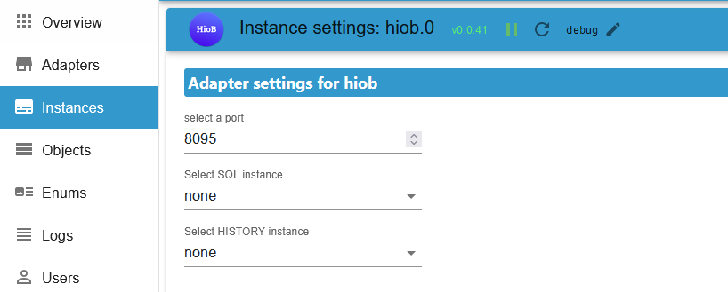
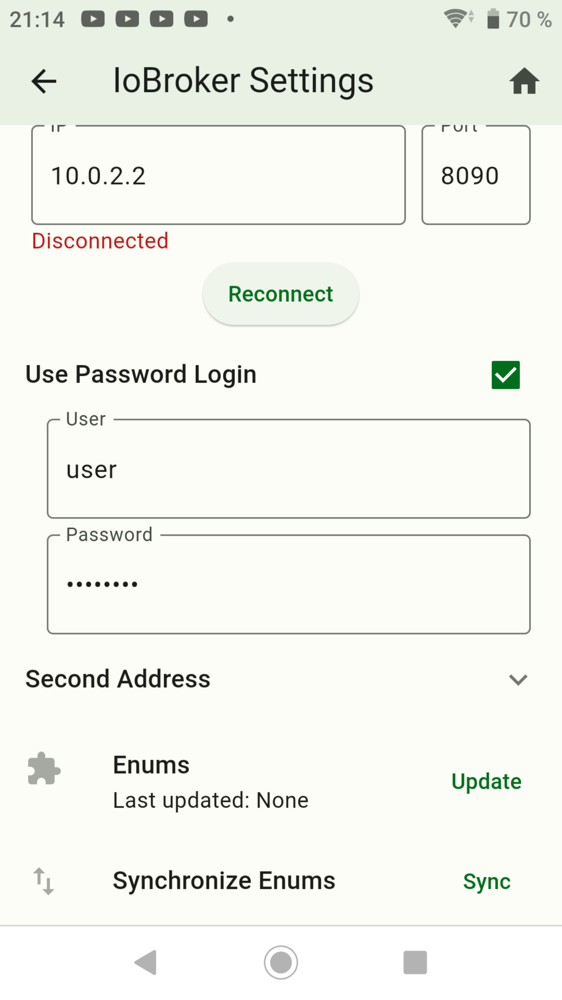
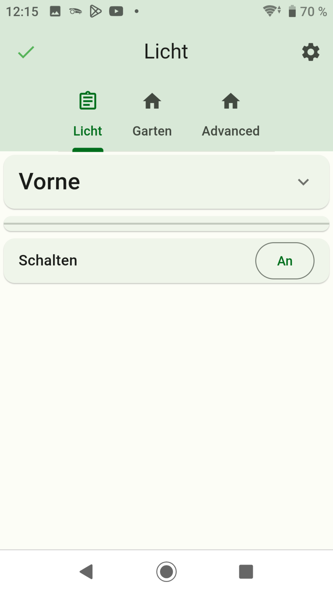
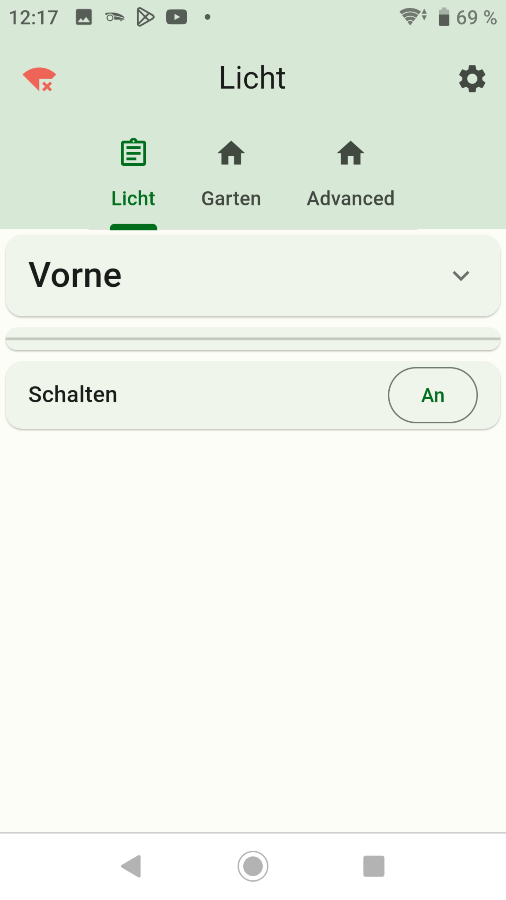

-   [Back to Summary](/docs/en/README.md)
-   [Step 2: Create Enums](enum.md)
-   [Step 3: Create Widgets](widgets.md)
-   [step 4: Create Screnns](sreens.md)
-   [Step 5: Create Backups](backups.md)

## Installation und APP Einrichtung `ioBroker Settings`

# Schritt 1: Installation und APP Einrichtung

# Schritt 1: Instanz Einstellungen

1. Bitte einen freien Port (Standard ist 8090) eintragen. Sollte der ausgewählte Port belegt sein, wird der nächste freie Port verwendet. Diesen wird ins Log sehen geschrieben und sollte dann in der Konfig-Instanz übernommen werden.
2. Für das Grafik Widget benötigt man entweder den SQL oder Histroy Adapter um Änderungen von Datenpunkte aufzuzeichnen. Bitte entweder eine SQL- oder History-Instanz auswählen.
3. Nun den Adapter starten.

# Schritt 2: User anlegen (OPTIONAL)

## Für Passwort Login muss ein neuer User angelegt werden

1. Links Benutzer auswählen und rechts Benutzer hinzufügen.

2. Hier nun den Username und ein Passwort eintragen. Danach auf speichern drücken.

# Schritt 3 mit Passwort: Login mit Passwort (Lokale Anmeldung)

1. Hier die IP von eurem ioBroker, Port, User und Passwort eintragen und den Button `Reconnect` drücken.

2. Danach unter Objekte den Datenpunkt `approved`, vom richtigen Geräte, auf true setzen (ohne den Haken Bestätigt)

3. Stimmt das Passwort oder der Username nicht wechselt der Datenpunkt wieder auf false und in der APP wird ein roter Text `Login declined` angezeigt. Bitte dann den Username und Passwort überprüfen und den Datenpunkt erneut auf true setzen.

4. Wurde alles richtig eingegeben erscheint nun einer grüner Text `Logged in`.

5. (Optional) Nun kann noch eine Weiterleitung eingetragen werden, damit man auch ausserhalb des Netzwerkes schalten kann. Zuvor muss die APP die Zugriffsrechte `Standort` erhalten. Dann das WLAN Netzwerk und die URL eintragen. Nun eine Weiterleitung in der Fritzbox einrichten. Das ist aber nicht zu empfehlen!! Besser wäre ein VPN Zugang. Z. Bsp. die APP `VpnCilla` verwenden (kostenpflichtig).

# Schritt 3 ohne Passwort: Login mit Passwort (Lokale Anmeldung)

1. Hier den Haken bei `Use Passwort Login` entfernen und eure IP + Port vom ioBroker eintragen und den Button `Reconnect` drücken.

2. Den Datenpunkt `noPwdAllowed` auf true setzen (ohne den Haken Bestätigt) und dann den Datenpunkt `approved` auch auf true setzen (ohne den Haken Bestätigt).

3. Wurde alles richtig umgesetzt dann sollte es so aussehen.

# Wichtige Infos

- Möchte man einen User sperren dann einfach den Datenpunkt `approved` auf false setzen.
- In der View erscheint nun links oben ein grüner Haken wenn man Verbunden ist.
- Sollte dort ein rotes WLAN Zeichen blinken, dann kann keine Verbindung aufgebaut werden. Entweder befindet man sich nicht im selben Netzwerk oder der Datenpunkt `approved` steht auf false.

-   [Back to Summary](/docs/en/README.md)
-   [Step 2: Create Enums](enum.md)
-   [Step 3: Create Widgets](widgets.md)
-   [step 4: Create Screnns](sreens.md)
-   [Step 5: Create Backups](backups.md)