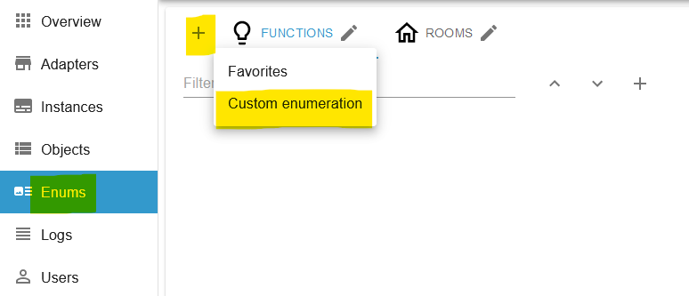
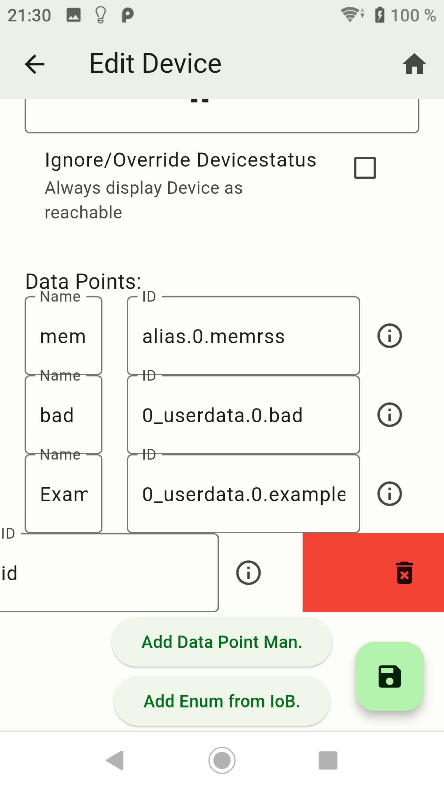

-   [Back to Summary](/docs/en/README.md)
-   [Step 1: Installation and APP setup](app.md)
-   [Step 2: Create Enums](enum.md)
-   [Step 3: Create Widgets](widgets.md)
-   [step 4: Create Screnns](sreens.md)
-   [Step 5: Create Backups](backups.md)

## Create enums and APP `ioBroker Settings` + `Device Settings`

# Step 1: Create Enums

1. Creates a new enum `job` (all lower case). “Hiob” must be entered under “Name” and “Edit ID”. The other fields are optional.

2. Now you can create as many categories as you want under ENMU `hiob`. It would be advantageous to choose categories such as light, sockets or rooms. It is then a little easier to find the desired data points in the APP.

3. It is recommended to create adapter data points as `alias`. The adapter `alias-manager` is recommended for this. Then create a new `channel` here and add the data points there with the `alias manager`. Data points under 0_userdata.x or javascript.x do not necessarily have to be created as aliases.

4. Now drag the desired data points into the Job lists.

5. Go back to the APP in `ioBroker Settings` and press `Update` and then `Sync`.

6. Now switch to `Device Settings` in the APP. If the categories are displayed in green, then everything worked. If the categories are red, please run `Update` again and then `Sync`.
Categories can be deleted by swiping from right to left. These appear again after `Update` & `Sync`. It is possible to create your own categories and enter new data points into them. Of course, these must be available in the ioBroker. However, these will also be deleted after `Update` & `Sync`. Therefore, after the settings/changes, make a backup or create a new backup!!!

7. You can create a new category by clicking on the + sign. Enter a name here that can be easily assigned.

8. New data points can be added by pressing `Add data point man.`. The ID must exist in ioBroker. E.g.: Name: Worx Party Mode and ID: worx.0.702470273301009453d9.mower.partyMode. But it would be better to create everything using alias and then assign it to the enums.
Then press save.

9. Tap on a category to go to the next view. Change the names or IDs here or add new data points. Data points can be deleted by swiping from right to left.

10. By clicking on the 'i', additional information about the data point appears.

# Add Enum is currently not working!!!

-   [Back to Summary](/docs/en/README.md)
-   [Step 1: Installation and APP setup](app.md)
-   [Step 2: Create Enums](enum.md)
-   [Step 3: Create Widgets](widgets.md)
-   [step 4: Create Screnns](sreens.md)
-   [Step 5: Create Backups](backups.md)