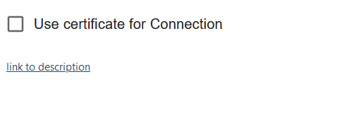

-   [Back to Summary](/docs/en/README.md)

# Secure connection

Encrypt messages between the adapter and your cell phone?

## Notice

Adapter version at least 0.0.54

## Create a certificate

```bash
cd /opt/iobroker
mkdir cert
cd cert
openssl req -newkey rsa:4096 \
            -x509 \
            -sha256 \
            -days 3650 \
            -nodes \
            -out hiob.crt \
            -keyout hiob.key 
```

## certificate

```
pi@iobroker:~ $ cd /opt/iobroker
pi@iobroker:/opt/iobroker $ mkdir cert
pi@iobroker:/opt/iobroker $ cd cert
pi@iobroker:/opt/iobroker/cert $ openssl req -newkey rsa:4096 \
            -x509 \
            -sha256 \
            -days 3650 \
            -nodes \
            -out hiob.crt \
            -keyout hiob.key
..+.....+.........+...............+......+.+......+...+.....+......+++++++++++++                                                                                                             ++++++++++++++++++++++++++++++++++++++++++++++++++++*...........................                                                        
-----
You are about to be asked to enter information that will be incorporated
into your certificate request.
What you are about to enter is what is called a Distinguished Name or a DN.
There are quite a few fields but you can leave some blank
For some fields there will be a default value,
If you enter '.', the field will be left blank.
-----
Country Name (2 letter code) [AU]:Your_2_letter_ISO_country_code Example DE
State or Province Name (full name) [Some-State]:Your_State_Province_or_County Example NRW
Locality Name (eg, city) []:Your_City Example Düsseldorf
Organization Name (eg, company) [Internet Widgits Pty Ltd]:Your_Company Example HIOB
Organizational Unit Name (eg, section) []:Your_Department Example HIOB
Common Name (e.g. server FQDN or YOUR name) []:secure.yourwebsite.com
Email Address []:youremail@yourwebsite.com
pi@iobroker:/opt/iobroker/cert $ sudo chown iobroker hiob.crt
pi@iobroker:/opt/iobroker/cert $ sudo chown iobroker hiob.key
pi@iobroker:/opt/iobroker/cert $
```

## chown rights

```bash
sudo chown iobroker hiob.crt
sudo chown iobroker hiob.key
```

## Settings

-   Check “Use certificate Connection” and enter the respective paths




-   In the APP settings, tick the box “Use secure connection”.


